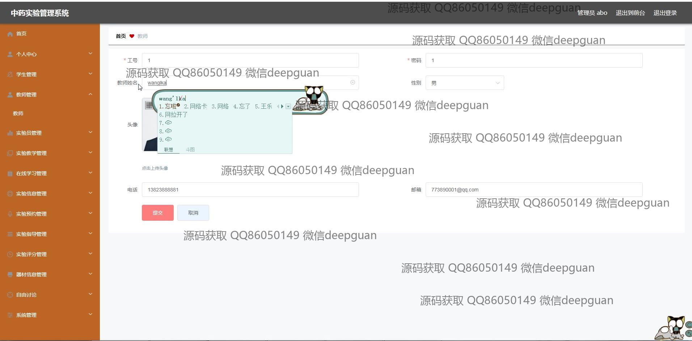
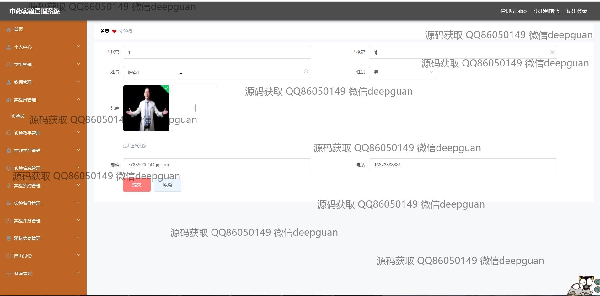
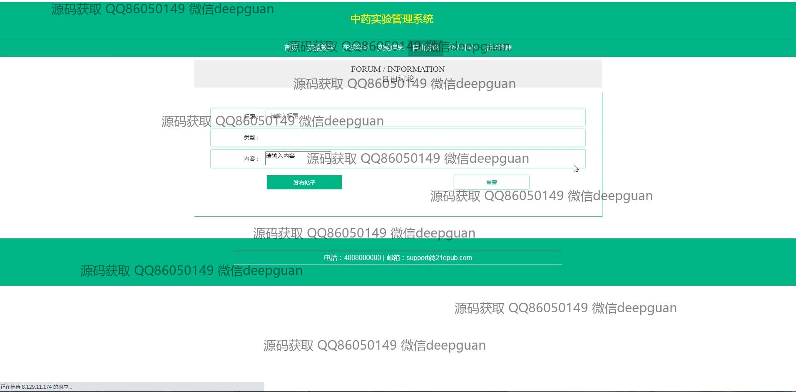
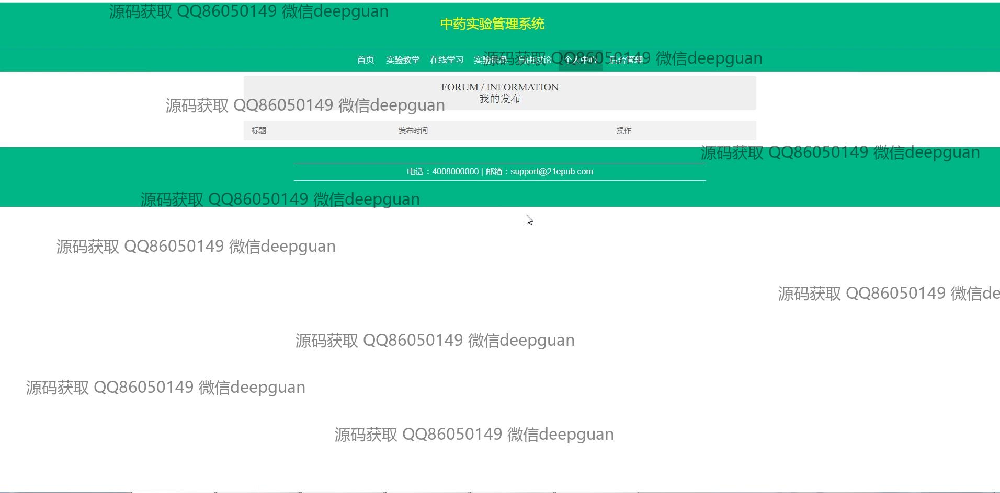
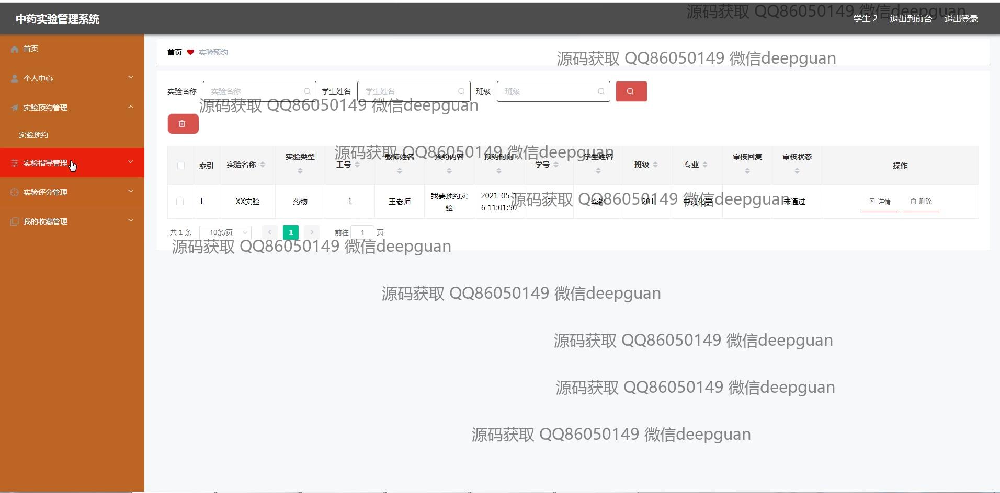
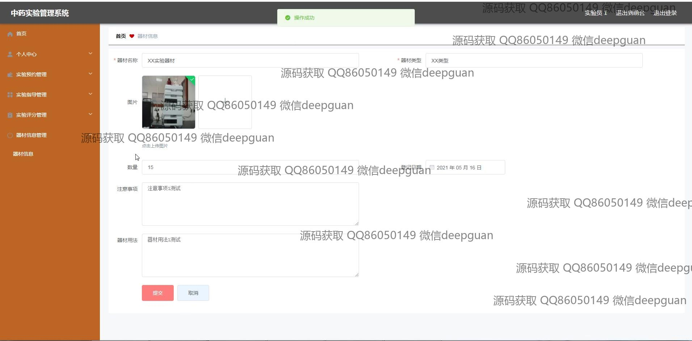

<h1 align="center">中药实验管理系统设计与实现</h1>

## 简介
中药实验管理系统：角色包括管理员和用户；功能涵盖实验信息管理、教师和学生管理、实验预约、在线学习、实验评分、讨论交流，提升实验室管理效率和资源共享。    --计算机毕业设计源码；毕设源码；java毕业设计源码

## 联系方式

<h3 align="center">获取完整代码与数据库文件 + 微信：deepguan QQ: 86050149 QQ群: 783742310</h3>

<h3 align="center">可帮忙远程部署 包运行成功！提供远程部署、修改代码、设计文档指导、代码讲解等服务！</h3>

## 功能介绍（完整见运行截图）
管理员：提供登录和注册功能，通过主导航栏管理实验教学、在线学习、实验信息、自由讨论、个人中心和后台管理等模块。拥有权限编辑和管理教师、学生和实验员信息。支持实验预约管理、实验成绩管理和实验数据管理，监控论坛讨论内容，并可进行详细的实验信息录入和更新。

教师：管理个人信息，能够查看及编辑实验信息和实验教学内容。可以录入实验数据，设计实验的详细内容，安排实验的时间和地点，上传教学视频和相关资源，并管理学生的实验成绩。

学生：主要使用注册和登录功能，交互界面包括查看个人信息、管理实验预约及参与在线学习等。学生可以在实验信息模块中查看实验详情，参与实验预约，访问发布的在线学习材料。

实验员：管理实验数据和器材信息的录入、修改和查询。支持实验预约的审核及管理实验室资源，确保实验顺利进行，同时，协助教师发布实验内容并管理实验成绩。

## 运行截图

本代码来源于网络,仅供学习参考使用!

